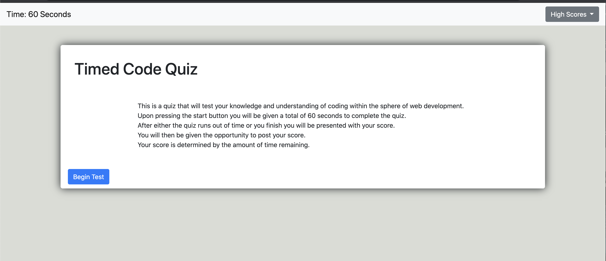

# Code_Quiz_Assign4

# Purpose 
The purpose of this assignment was to create a multiple choice quiz that had a count-down timer that would lose even more time if the user answered incorrectly. Upon completeling this quiz or when the timer ran out, the user would be given the opportunity to enter their initials and have their score placed in the highscore log while also being stored within local storage so that it would remain even after the user left the page. I built this project so as to apply my newfound knowledge of javascript and DOMs. This includes creating new content within javascript and appending it to the html, eventlisteners, timerIntervals, localstorage, JSON, if/else statements, for loops, prompts, confirms, alerts, and console logs.   

# Process
* HTML:
* First I built a responsive webpage in html that had elements that I could call upon in Javascript.
* JAVASCRIPT: 
* I then took those elements that I built in html and made them accessable in javascript via getelementbyID or querySelect
* I then built a timer function that would count down from sixty that would begin when the begin-test button was pressed
* Then I constructed an array that contained objects for each question, with corresponding answers and an integer that matched the placement of the correct answer.
* After this I built a function that created a button for each answer as each question appeared by using a for loop. These buttons were each given a unique id to keep the program from being confused when clcked.
* Inside of this function I placed a click event that would check to see if the answer's placement in the array matched the correct integer. If it did, nothing happened besides the program moving on to the next question. If it was incorrect, the program would subtract ten seconds from the timer to penalize the user. 
* I then constructed a function that would reveal the submission form at the end of the quiz (either when the timer ran out or the user finished).
* Upon writing their intials (less than two characters but greater than zero), the score and their initials would be placed within an array of arrays that would be moved to local storage via JSON stringify, and then would be populated within the score dropdown via JSON parse. 
* CSS: 
* Finally, I used css to customize the appearance of the html 

# Issues I Encountered:
* The biggest issue I encountered was using an array in order to hold all of my questions, answers and correct statements. Initially I wrote out the correct answer as a string, but an instructional assistant showed how the slightest mistake with that would make it so that the function would not choose any answer as correct. Instead, I had to learn the more elegent method of placing an integer in "correct" that corresponded with the placement of the matching answer in its array. (example if the answer was number three on the array, correct would be labeled as 2, because the array starts at zero).
* Another issue was wrestling with the formatting of bootstrap, although this time I was able to work more with it instead of trying to fight against it as in assignment 2. 
* The third major issue was trying to store my highscores within the local storage. I eventually realized that if I wanted to store all of the recorded highscores, I would need to build an array of arrays, using JSON to stringify and parse it in order to avoid with the user being presented [object, object] 

# What I Learned: 
* How to set timers and build buttons that will operate when clicked upon
* How to create material for html within javascript 
* How to take an array, give each of the objects within a value, and then use that value to decide whether the user chose the correct answer when pressing a button 
* How to set something within local storage and then display it. 
* How to use JSON to place an array within local storage by first stringifying it and then using parse to make it an array once more upon retrieval 

# Link:
https://corvus-cyber.github.io/Code_Quiz_Assign4/

# Screenshots: 

